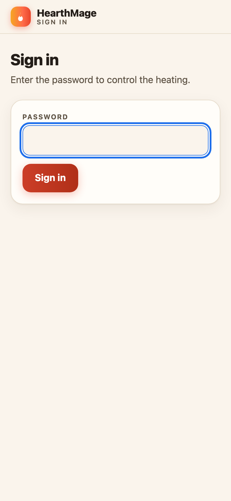
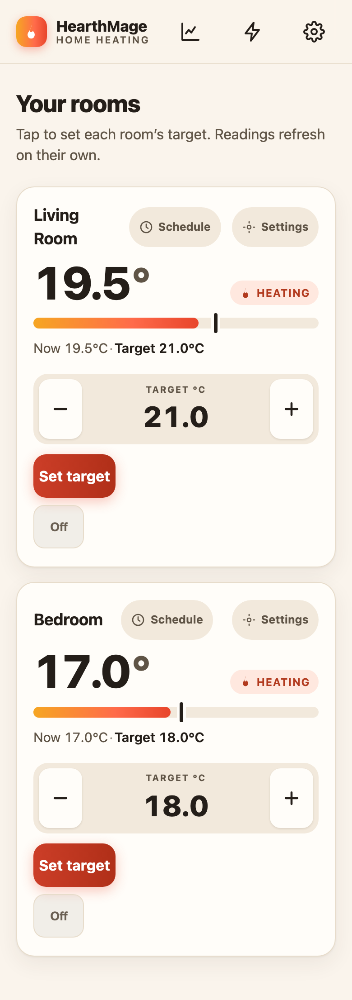
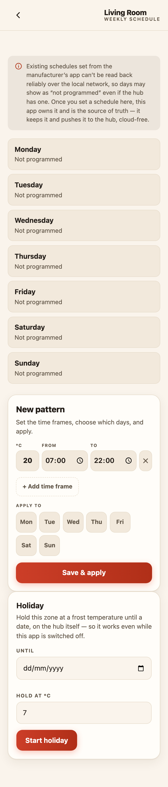
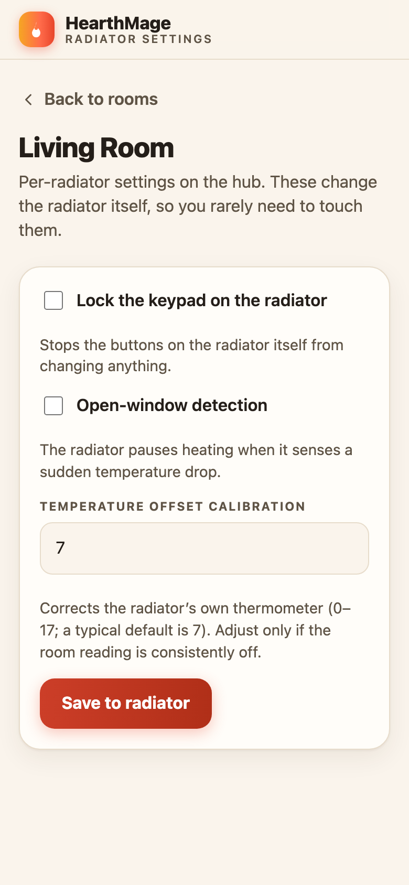
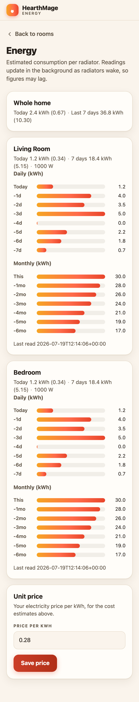
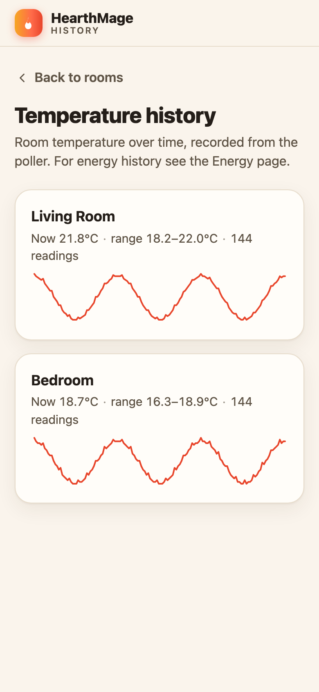
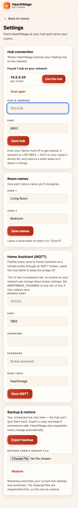

# HearthMage user manual

HearthMage is a web app for controlling Farho Nexho NT / ELKAtherm electric
radiators from your phone or computer. It talks to your heating hub directly
over your home network, with no cloud account and nothing leaving the house.

This manual walks through everyday use. For installing and running the app, see
the [README](../README.md).

The screenshots below show the phone layout. On a wider screen the same controls
sit side by side, but everything works the same way.

## Contents

- [Opening the app](#opening-the-app)
- [Signing in](#signing-in)
- [The rooms screen](#the-rooms-screen)
- [Setting a target temperature](#setting-a-target-temperature)
- [Weekly schedules](#weekly-schedules)
- [Holiday mode](#holiday-mode)
- [Radiator settings](#radiator-settings)
- [Energy](#energy)
- [Temperature history](#temperature-history)
- [Settings](#settings)
- [Home Assistant](#home-assistant)
- [Troubleshooting](#troubleshooting)

## Opening the app

Open the app's address in a browser (for example `http://192.168.1.50:8080`, or
whatever address your install uses). On a phone you can add it to your home
screen so it opens like a normal app: use your browser's "Add to Home Screen"
option. It then runs full screen and remembers where it is.

## Signing in

If your install has a password set, you are asked for it once per device. Enter
the password and tap **Sign in**. A signed-in session is remembered until you
sign out (there is a **Sign out** button at the bottom of Settings).

If no password is set, the app opens straight to your rooms with no sign-in.
This is fine on a trusted home network; if you want a password, see
[Settings](#settings) and the README.

## The rooms screen

This is the home screen. Each room (the hub calls them zones) is a card showing
its current temperature, a coloured bar, and a heating status.

Reading a card:

- **The big number** is the temperature the radiator senses right now.
- **The coloured bar** fills from the left as the room warms toward its target.
  The small marker on the bar is where the target sits.
- **Now / Target** spells out the current reading and the target in words.
- **The status pill** on the right shows what the radiator is doing:
  - **HEATING** — actively warming toward the target.
  - **COMFORT** — at or above the target, resting.
  - **OFF** — the radiator is switched off.

Readings refresh on their own every few seconds, so you can leave the screen
open and watch it update.

The top bar has shortcuts to the [History](#temperature-history) (the chart
icon), [Energy](#energy) (the lightning icon), and [Settings](#settings) (the
gear icon) pages. Each room card also has **Schedule** and **Settings** links
for that specific room.

## Setting a target temperature

On a room card, use the **minus** and **plus** buttons to choose a target, then
tap **Set target**. Targets move in half-degree steps, so you can ask for 20.5
as easily as 20 or 21.

Tap **Off** to switch the radiator off completely. To turn it back on, pick a
target and tap **Set target** again.

Your change is sent to the radiator over the network. The card updates
immediately to show the new target, and the status pill follows once the
radiator responds.

## Weekly schedules

A schedule sets different temperatures at different times of day, repeating every
week. Open it from a room card's **Schedule** link.

The list at the top shows each day of the week and whether it has a program. To
create or change one, use **New pattern**:

1. Set a temperature (`°C`) and a time frame with a **From** and **To** time.
2. Add more time frames with **+ Add time frame** if the day needs several
   (for example warm in the morning, cooler midday, warm again in the evening).
   Any time not covered by a frame falls back to the radiator's own low setting.
3. Under **Apply to**, tap the days this pattern should cover. You can select
   several at once.
4. Tap **Save & apply**.

The pattern is saved and pushed to the hub. If a radiator is asleep when you
save, HearthMage keeps trying in the background and pushes it as soon as the
radiator is reachable.

**Why days can show "Not programmed":** the manufacturer's own app writes
schedules in a way that can't be read back reliably over the local network. So a
day may show as "not programmed" even if the hub is running one. Once you set a
schedule here, HearthMage owns it, stores it, and is the source of truth. Keep a
backup (see [Settings](#settings)) so you never lose your patterns.

## Holiday mode

At the bottom of the schedule screen, **Holiday** holds a room at a low frost
temperature until a date you choose.

- Set an **Until** date and a **Hold at °C** temperature, then tap
  **Start holiday**.
- The hold is set on the hub itself, so it keeps working even if HearthMage or
  the computer running it is switched off.
- To end it early, come back and cancel the holiday; the room returns to its
  previous target.

## Radiator settings

Each room card's **Settings** link opens per-radiator options. These change the
radiator hardware itself, so you rarely need them.

- **Lock the keypad on the radiator** — stops the buttons on the radiator from
  changing anything, useful in a rental or a child's room.
- **Open-window detection** — the radiator pauses heating when it senses a
  sudden temperature drop, such as a window being opened.
- **Temperature offset calibration** — corrects the radiator's own thermometer.
  The range is 0–17 and a typical default is 7. Only adjust this if the room
  reading is consistently wrong compared to a thermometer you trust.

Tap **Save to radiator** to apply.

## Energy

The **Energy** page (lightning icon in the top bar) estimates how much
electricity each radiator has used.

- **Whole home** sums today and the last seven days across all radiators.
- Each room shows **Daily** bars (today and the previous seven days) and
  **Monthly** bars, in kWh.
- If you set a unit price (below), each figure also shows an estimated cost in
  brackets.

Set your electricity price in **Unit price** — enter your price per kWh and tap
**Save price**. All the cost estimates use it.

Energy figures come from the radiators themselves and update in the background as
each radiator wakes up, so a room may briefly show "No energy reading yet" or a
figure that lags. It catches up on its own.

## Temperature history

The **History** page (chart icon in the top bar) draws each room's temperature
over time, so you can see how it has tracked through the day.

Each room shows its current reading, the range (low to high) over the recorded
period, how many readings there are, and a line chart. History builds up while
the app runs, so a fresh install shows "Not enough readings yet" until the app
has been watching for a while.

## Settings

The **Settings** page (gear icon) is where you connect to the hub, name rooms,
set up Home Assistant, and manage backups.

**Hub connection.** HearthMage can scan your network and offer any hub it finds
("Found 1 hub on your network") — tap **Use this hub**. Or enter the hub's IP
address by hand and tap **Save hub**. The hub answers on UDP port 6653; find its
address in your router's device list, and reserve a fixed address for it so it
doesn't change.

**Room names.** Give each zone a name you'll recognise, like "Living Room", and
tap **Save names**. Leave a name blank to reset it to "Zone N".

**Home Assistant (MQTT).** Connects HearthMage to Home Assistant so your
radiators appear there as thermostats. See [Home Assistant](#home-assistant)
below. If you leave the broker host blank, the bridge stays off.

**Backup & restore.** Your schedules live only in HearthMage, so keep a copy.
Tap **Export backup** to download a file with your settings and schedules.
To restore, choose a backup file and tap **Restore**. HearthMage also snapshots
every change automatically, and a restore snapshots the current state first, so
it can be undone. (Exports never include your passwords — those stay on the
server.)

## Home Assistant

HearthMage can publish every room to Home Assistant over MQTT, where each
appears as a climate (thermostat) entity you can control and automate. All
commands still flow through HearthMage, so the hub keeps a single owner and
nothing else talks to it directly.

To set it up, you need an MQTT broker that Home Assistant uses (the Mosquitto
add-on is the usual choice). Then, on the [Settings](#settings) page, fill in the
**Home Assistant (MQTT)** section:

- **Broker host** and **Port** — where your MQTT broker runs (port 1883 is
  typical).
- **Username** and **Password** — if your broker requires them. The password is
  write-only: HearthMage stores it but never shows it back. Leave it blank to
  keep the current one; use the clear option to remove it.
- **Base topic** — leave as `hearthmage` unless you have a reason to change it.

Tap **Save MQTT**. The rooms appear in Home Assistant automatically. To turn the
bridge off, use **Disable MQTT**.

If the app has no password set, this section shows a warning: anyone on your
network can change these broker settings. Set a password first if that matters
to you.

## Troubleshooting

**A room shows a stale or old reading.** The radiator may be briefly unreachable
over RF. HearthMage keeps the last known value and retries; it usually recovers
on its own. A hub-wide problem shows a banner at the top of the rooms screen.

**Discovery doesn't find the hub.** Enter the hub's IP address by hand in
Settings. Make sure the device running HearthMage is on the same network as the
hub, and reserve a fixed address for the hub in your router.

**"No energy reading yet" won't clear.** Radiators report energy only when awake,
and reads can fail while they sleep. Give it time; it fills in as radiators wake.

**A schedule day shows "Not programmed" after I set it.** If you just saved it,
it may still be pushing to a sleeping radiator. If it persists, re-open the
schedule and save again. Remember that schedules set from the manufacturer's app
can't be read back, so HearthMage only shows what it manages itself.

**I lost my schedules.** Restore from a backup on the Settings page. Export a
fresh backup whenever you change your patterns so you always have a recent copy.
